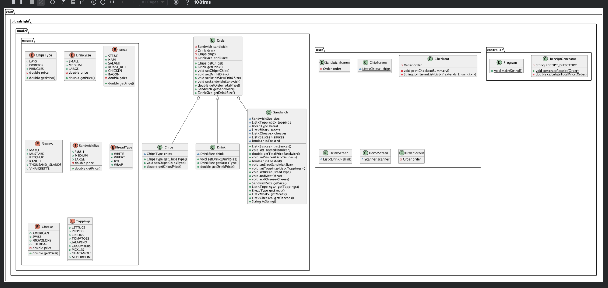

# DELI - icous 

## Description

This is a command-line-based application for managing sandwich orders. It allows users to create custom sandwich orders by selecting a variety of sandwich components, such as bread type, meat, cheese, toppings, sauces, and whether the sandwich should be toasted. Users can also select drinks and chips, and the system calculates the total price of the order based on the selected items.

The system is designed using Java, with an object-oriented approach that models the real-world entities of an order (i.e., Sandwich, Drink, Chips) and handles the creation, modification, and calculation of sandwich orders.

## Features

- **Create Custom Sandwiches**: Users can choose a bread type, sandwich size, meats, cheeses, toppings, and sauces.
- **Add Chips**: Users can select their preferred chips flavor.
- **Add Drink**: Users can choose the size of their drink.
- **Order Summary**: Once an order is placed, the user can see a breakdown of the selected items and the total price.
- **Price Calculation**: The total price of the order is dynamically calculated based on the user's selections (sandwich, chips, drink).
- **Order Management**: Users can manage their order and cancel if necessary.

# Components

### 1. Order Class
The `Order` class represents an order that can contain a sandwich, drink, and chips. It handles the calculation of the total price for the order and provides getter/setter methods to manage the items in the order.

### 2. Sandwich Class
The `Sandwich` class represents a custom sandwich order. It includes attributes such as bread type, sandwich size, toppings, meats, cheeses, sauces, and whether the sandwich is toasted. This class also includes methods to calculate the total price of the sandwich.

#### Key Methods:
- **`getTotalPriceSandwich()`**: Calculates the total price of the sandwich.
- **`toString()`**: Returns a string representation of the sandwich details (bread, toppings, meats, etc.).

### 3. Chips Class
The `Chips` class models the chips part of the order. It allows the user to select different types of chips, each with a fixed price.

### 4. Drink Class
The `Drink` class represents a drink order. It lets the user select the drink size, and the price is calculated based on the selected size.

### 5. Enums
The following enums are used to define different options for the sandwich:

- **`BreadType`**: Defines available bread types (e.g., White, Whole Wheat, etc.).
- **`Meat`**: Defines available meats (e.g., Turkey, Ham, Chicken).
- **`Cheese`**: Defines available cheeses (e.g., Cheddar, Swiss).
- **`Toppings`**: Defines available toppings (e.g., Lettuce, Tomato, Onion).
- **`Sauces`**: Defines available sauces (e.g., Mayo, Mustard).
- **`SandwichSize`**: Defines sandwich sizes (e.g., Small, Medium, Large).
- **`ChipsType`**: Defines chip types (e.g., Lays, Doritos, Pringles).
- **`DrinkSize`**: Defines drink sizes (e.g., Small, Medium, Large).

### 6. Checkout and Receipt
Once an order is complete, the system generates a summary of the order, including the sandwich, drink, chips, and their total price. This information is printed to the console, and the user is presented with the option to confirm or cancel the order.

### Creating an Order

1. **Add Sandwich**:
   The user is prompted to choose a bread type, sandwich size, toppings, meats, cheeses, sauces, and whether they want their sandwich toasted.

2. **Add Chips**:
   The user can select a chip flavor.

3. **Add Drink**:
   The user can choose the size of their drink.

4. **View Order Summary**:
   Once all items are added, the order summary is displayed, and the total price is calculated.

5. **Checkout**:
   The user can review the order summary and finalize the order by checking out.

# Classes Overview

### Main
The `Main` class is the entry point of the application. It initializes and manages the order process, calling various screens (Sandwich, Drink, Chips, etc.) to create a complete order. It serves as the starting point for the user interaction and orchestrates the flow of the application.

### OrderScreen
The `OrderScreen` class handles user input for creating and managing the order. It presents options to the user to add a sandwich, drink, chips, or proceed to checkout. The `OrderScreen` is responsible for collecting all the necessary items for the order and passing them to the `Order` object for processing.

### SandwichScreen
The `SandwichScreen` class allows the user to customize their sandwich. It provides an interface to choose the sandwich size, bread type, meats, cheeses, toppings, sauces, and whether the sandwich should be toasted. Once the sandwich is customized, it is added to the order.

### DrinkScreen
The `DrinkScreen` class prompts the user to select their drink. It allows the user to choose from various drink sizes (e.g., Small, Medium, Large), and it calculates the price based on the selected size. After selection, the drink is added to the order.

### ChipScreen
The `ChipScreen` class allows the user to choose the type of chips they want to add to their order. It provides options for different chip flavors (e.g., Lays, Doritos, Pringles), and each type has a predefined price. Once selected, the chip flavor is added to the order.

### Checkout
The `Checkout` class displays the summary of the order, including details of the sandwich, drink, and chips. It calculates and displays the total price of the order and provides an option to confirm the order. It also calls the `ReceiptGenerator` to generate a detailed receipt.

### ReceiptGenerator
The `ReceiptGenerator` is responsible for printing the detailed order summary, including itemized costs for the sandwich, drink, chips, and total order price. It formats and prints the order information to the console for the user to review before completing the transaction.

### UML DIAGRAM

# Conclusion

The Sandwich Order System provides a simple and interactive command-line interface for users to create and manage custom sandwich orders. By offering flexible options for sandwich ingredients, drinks, and chips, it ensures that each order is tailored to individual preferences. The application calculates the total price dynamically, providing users with a clear breakdown of costs for each component of the order.

Through the use of object-oriented programming principles, the system is modular and easily extendable, allowing for the addition of more menu items or modifications to existing options. Whether for personal use or as a starting point for a more complex ordering system, this application demonstrates fundamental concepts in software design, including classes, inheritance, and enums.

We hope this project serves as a useful reference for understanding how to structure and implement a simple ordering system in Java. Feel free to explore the code, contribute enhancements, and adapt the system to your needs.

Thank you for checking out this project, and happy coding!

